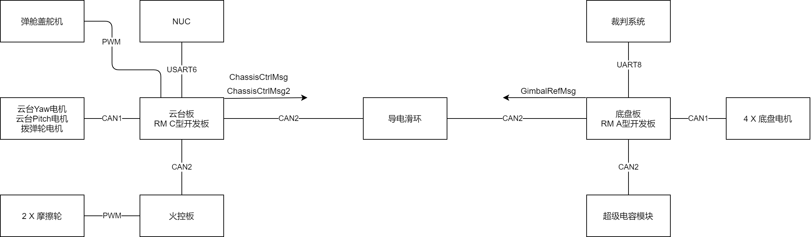
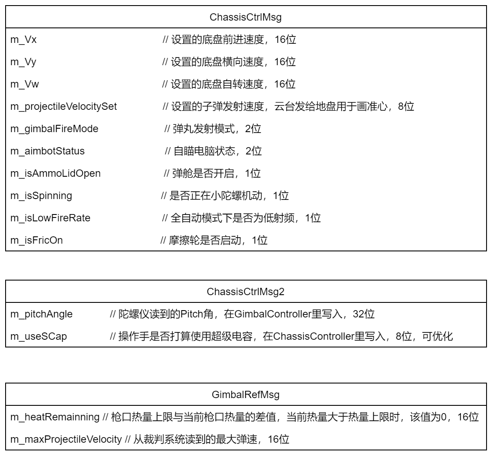

# 步兵机器人电控代码

代码分为两部分，保存在两个代码框架的分支里，保存在队里的gitlab上。

FS-stop-Infantry-gimbal分支是云台代码，FS-chassis是底盘代码。(FS指佛山，谁知道会延迟呢(笑))

超级电容模块和火控模块的对接没有做完，不过接口留好了，其他功能基本都实现了，就算没实现也有应该有足够多的例子可以拿来复制粘贴再改改。

系统连线图如下所示：

---

## 按键设置

### 左拨杆在中档时：

<kbd>WASD</kbd>前后左右移动

按住<kbd>R</kbd>反转拨弹电机，无HUD提示

按下<kbd>C</kbd>切换爆炸开火模式与全自动模式，HUD提示为 *MODE : BURST/AUTO*

按下<kbd>Z</kbd><kbd>X</kbd>切换全自动模式下的射频，HUD提示为 *FIRERATE:LOW/HIGH*

按下<kbd>F</kbd>切换是否自动控制枪口热量（**未实际打弹测试**），自动热量控制时枪口热量应该不会超，当HUD上MODE字体为红色时操作手控制热量，字体为绿色时自动控制热量

按下<kbd>G</kbd>开关弹舱盖，HUD提示为 *LID : OPEN/CLOSED*

按住<kbd>V</kbd>使用小陀螺机动，HUD提示为 *SPIN ： ON/OFF*

按住<kbd>B</kbd>使用底盘云台分离机动模式，无HUD提示，可能有BUG，需进一步测试

按住<kbd>Mouse2</kbd>使用自瞄，按住右键时滚滚轮微调Pitch偏移量，该偏移量松开右键后重置为0，自瞄中/不自喵/NUC跑飞了HUD提示分别为 *AIM ： AIMBOT/MANUAL/OFFLINE*

按住<kbd>Shift</kbd>使用超级电容，HUD上的电容条从12^2映射到24^2，使用电容时，电容条为橙色，不使用时为绿色，尚未与超级电容模块联动

每次上电需要先使用组合键<kbd>Ctrl</kbd> + <kbd>Q</kbd>初始化HUD

每个HUD元素都出现之后需要使用组合键<kbd>Ctrl</kbd> + <kbd>R</kbd>刷新所有HUD

右拨杆Middle_2_Down : 开启摩擦轮

右拨杆Down_2_Middle : 关闭摩擦轮

### 左拨杆在下档时

按住<kbd>Q</kbd>，<kbd>E</kbd>时底盘逆/顺时针旋转。

在下档时基本和在中档操作逻辑相同，但是不用陀螺仪，用于陀螺仪疯了的情况下使用。

---

## TODO

### 超级电容

获取到超级电容当前电压之后，需要调用底盘板上的HudManager实例的SetSCapVoltage(float voltage)成员函数设置显示到客户端HUD的电容电压，voltage应该在12.0f到24.0f之间。底盘板上可以通过ChassisCtrlMsg.UseSCap()来判断操作手是否想使用超级电容。

### 火控板

将云台板的ShooterController实例的Updata()成员函数中定义的变量projectielVelocitySet改为火控板设置的弹速，单位m/s，如果设置了动态准心(底盘板HudManager::m_enableDynamicCrosshair设置为true)，准心将会以这个值与当前陀螺仪的Pitch角画准心；不使用动态准心时，pitch角设为0°

目前，弹速设置操作为：底盘板从裁判系统读到允许最大弹速，打个包通过CAN2发给云台板，云台板直接将该值设置为projectielVelocitySet，同时把projectielVelocitySet这个值发给底盘板和火控板，底盘板再根据这个更新准心。但是测试时，发现从裁判系统读出来的17mm最大弹速一直是15m/s，需要做进一步测试。

### 云台绝对角控制模式（GimbalStateMouseControl）

有点混乱，可以尝试重构代码。

因为板载IMU读法有点复杂，有时间可以找人再整一下陀螺仪模块的驱动，然后用外接的陀螺仪模块。

同样因为IMU的接口，云台控制实际上使用的都是GetAbsYaw()这个接口读出来的角度，返回的角度是会小于-180°或大于180°的，可以考虑尝试使用四元数插值来控制云台，应该能彻底摆脱欧拉角的各式各样的坑。但是四元数比较抽象，需要花时间慢慢搞。

---

## 板间通讯

除了老一批已有的板间通讯包，新的板间通讯包的实例都在BoardPacketManager里，不管是不是基于通讯包的，底盘板需要定期给云台板发送热量信息的数据，所以在底盘板上的BoardPacketManager的Update函数被改成了虚函数，在BoardPacketManager的Update里转发裁判系统数据。

为了减少带宽，云台板和底盘板之间数据同步直接使用了单纯的CAN帧，没有用数据包。

板间包通讯可以拿来当简单的RPC用，具体看云台板的TestPacket和底盘板HudManager的例子，利用了观察者类做的。

云台板和底盘板之间的CAN包定义如下：

---

## HudManager

用来画HUD的，仅底盘板上存在。

JudgeSystem自带定时flush发送缓冲功能，裁判系统更新UI的频率最高为10Hz，需要注意UI更新频率不能超过这个频率，除了文字，其他图像的更新可以被打包成一次更新发送，一次打包最多包含七个图形(准心正好是七个图形)，这个打包过程是自动的，直接调JudgeSystem::Instance()->ModfiyCharOnClient(&shapeSetting);就行。

写的非常简陋的脏标记更新，只会更新变化过的HUD元素，有个小bug：启动时显示的内容不一定是最新的，不过可以按下<kbd>Ctrl</kbd> + <kbd>R</kbd>强制刷新所有HUD
